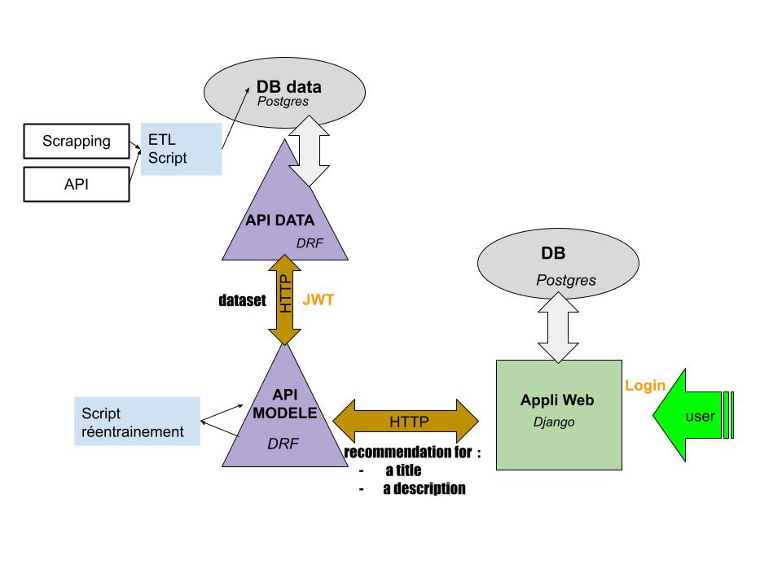
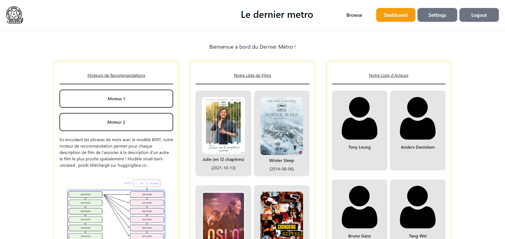
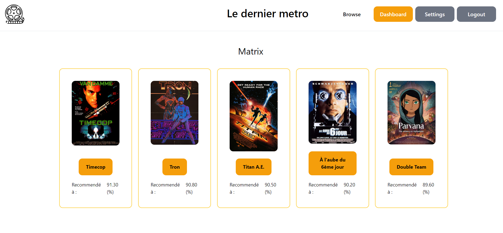

# Movie Recommendation System 

<h2>A. Presentation</h2>
Project introducing MLOps approach  
The goal is for a user to make recommendations based on a given title or a  descritption.  
 
<h1>B. How does the system work ? </h1>
<h3> 0. System Schema </h3>
 
 
 
<h2> 1. Data's API </h2>
1. Raw data is extracted ( imdb scrapping and api requests ), transformed and loaded in the database. 
2. Data is created (<b> see database_conception.pdf </b> )  
3. An API have access to the database  
4. Data can then be request with prior JWT authentication  
<h2> 2. Model's API </h2>
1. With the data, the vector's embeddings of the movies's description are computed by a BERT model. 
2. Having all the embeddings, the cosine similarity matrix is then saved as a static file in the model's API. 
3. An API with the cosine matrix can then compare from a given title , the most similar descriptions vectors. Also the API can compute with the model the embeddings and directly compare it with the one it has.  
<h2>3. Website</h2> 
An authenticated user can :  
- access all the movies data   
- get the recommendations
<h3> A few peeks at the result : </h3>
 Homepage 
  
 
 
Recommendation page  
 
 

<h2>Notes</h2>
This was a school project, no safety for production or whatsoever is ensured as it was not the goal. 
For the same reason , tests were not done. 
